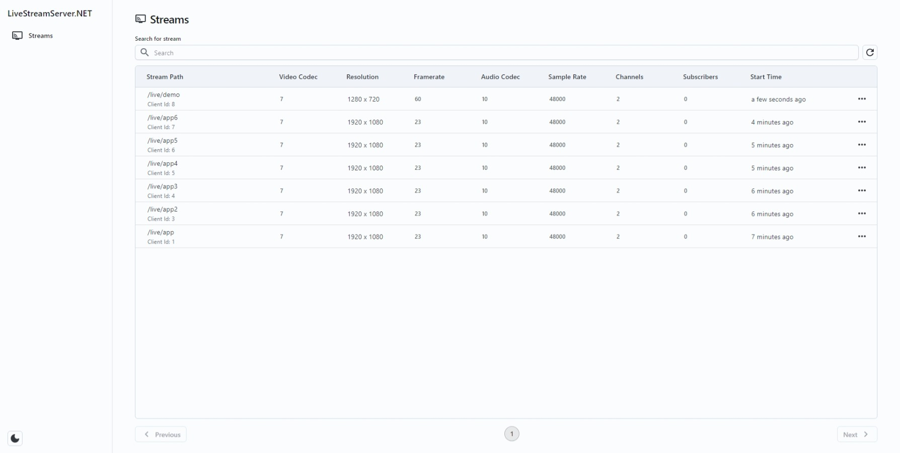

# Adding an Admin Panel

This guide will provide an explanation about adding an admin panel to the live streaming server. The admin panel allows you to browse the list of live streams, delete them, and preview the live streams via HTTP-FLV.

### Step 1: Initialize a New Project and Add Required Packages

An admin panel is served by a middleware of ASP.NET Core. Create an empty ASP.NET Core Web application and add the necessary packages using the following commands:

```
dotnet new web
dotnet add package LiveStreamingServerNet.AdminPanelUI
dotnet add package LiveStreamingServerNet.Standalone
dotnet add package LiveStreamingServerNet.Flv
```

The `LiveStreamingServerNet.AdminPanelUI` package is responsible for supplying the admin panel user interface. `The LiveStreamingServerNet.Standalone` package delivers the Web API endpoints that the admin panel UI utilizes. Meanwhile, the `LiveStreamingServerNet.Flv` package enables the HTTP-FLV preview functionality.

### Step 2: Configure Your Live Streaming Server

Edit `Program.cs` file:

```
using LiveStreamingServerNet;
using LiveStreamingServerNet.AdminPanelUI;
using LiveStreamingServerNet.Flv.Installer;
using LiveStreamingServerNet.Networking.Helpers;
using LiveStreamingServerNet.Standalone;
using LiveStreamingServerNet.Standalone.Insatller;
using System.Net;

using var liveStreamingServer = LiveStreamingServerBuilder.Create()
    .ConfigureRtmpServer(options => options.AddStandaloneServices().AddFlv())
    .ConfigureLogging(options => options.AddConsole())
    .Build();

var builder = WebApplication.CreateBuilder(args);

builder.Services.AddBackgroundServer(liveStreamingServer, new IPEndPoint(IPAddress.Any, 1935));

var app = builder.Build();

app.UseHttpFlv(liveStreamingServer);
app.MapStandaloneServerApiEndPoints(liveStreamingServer);
app.UseAdminPanelUI(new AdminPanelUIOptions { BasePath = "/ui", HasHttpFlvPreview = true });

app.Run();
```

This code sets up the live streaming server and the ASP.NET Core web app, while the live streaming server will run alongside the web app using port 1935. In addition, the web app will serve both HTTP-FLV and the admin panel UI, as well as the API endpoints required by the admin panel.

### Step 3: Launch Your Live Streaming Server

Execute your live streaming server by running the following command:

```
dotnet run --urls="https://+:8080"
```

Now, your live streaming server should be running and ready to accept RTMP streams via port 1935, and you can visit the admin panel at `https://localhost:8080/ui`.

### Preview of the Admin Panel




