---
hide:
  - navigation
---

# Performance Benchmark

## Method

To conduct the performance benchmarking, all the applications are packaged as Docker images and deployed to [Azure Container Instances](https://azure.microsoft.com/en-us/products/container-instances) with the configuration of `1 vCPU, 2 GiB memory, 0 GPUs`, running on Linux OS.

To facilitate large-scale stream publishing and subscription, the [srs-bench](https://github.com/ossrs/srs-bench/tree/master) benchmarking tool is employed. Besides, all benchmarking tests were performed with the same set of videos at different resolutions and bitrates, including `320P at 200 kbps`, `480P at 500 kbps`, and `720P at 1500 kbps`.

## Code

The following code sets up a live streaming server capable of:

1. Accepting and broadcasting AVC/AAC RTMP streams.
2. Transmuxing all the incoming RTMP stream into an HLS stream with the built-in HLS transmuxer.
3. Serving HLS streams via ASP.NET Core’s static file middleware.
4. Enabling GOP caching based on the `RTMP_ENABLE_GOP_CACHING` environment variable.
5. Batching media packages within a `350ms` window to optimize performance for large-scale RTMP broadcasting.
6. Providing an admin panel UI.

```cs linenums="1"
using LiveStreamingServerNet;
using LiveStreamingServerNet.AdminPanelUI;
using LiveStreamingServerNet.Networking.Helpers;
using LiveStreamingServerNet.Rtmp;
using LiveStreamingServerNet.Standalone;
using LiveStreamingServerNet.Standalone.Insatller;
using LiveStreamingServerNet.StreamProcessor.Hls.Contracts;
using LiveStreamingServerNet.StreamProcessor.Installer;
using Microsoft.AspNetCore.StaticFiles;
using Microsoft.Extensions.FileProviders;
using System.Net;

var builder = WebApplication.CreateBuilder(args);

var hlsOutputDir = Path.Combine(Directory.GetCurrentDirectory(), "output");
var hlsOutputPathResolver = new HlsOutputPathResolver(hlsOutputDir);

var liveStreamingServer = CreateLiveStreamingServer(hlsOutputPathResolver);
builder.Services.AddBackgroundServer(liveStreamingServer, new IPEndPoint(IPAddress.Any, 1935));

builder.Services.AddCors(options =>
    options.AddDefaultPolicy(policy =>
        policy.AllowAnyHeader()
              .AllowAnyOrigin()
              .AllowAnyMethod()
    )
);

var app = builder.Build();

app.UseCors();

var (fileProvider, contentTypeProvider) = CreateProviders(hlsOutputDir);
app.UseStaticFiles(new StaticFileOptions
{
    FileProvider = fileProvider,
    ContentTypeProvider = contentTypeProvider
});

app.MapStandaloneServerApiEndPoints(liveStreamingServer);
app.UseAdminPanelUI();

await app.RunAsync();

static ILiveStreamingServer CreateLiveStreamingServer(HlsOutputPathResolver hlsOutputPathResolver)
{
    var builder = LiveStreamingServerBuilder.Create();
    var configuration = new ConfigurationBuilder().AddEnvironmentVariables().Build();

    builder.ConfigureLogging(logging => logging.AddConsole());

    builder.ConfigureRtmpServer(serverConfig =>
    {
        serverConfig.Configure(options =>
        {
            options.EnableGopCaching = configuration.GetValue<bool>("RTMP_ENABLE_GOP_CACHING", true);
            options.MediaPackageBatchWindow = TimeSpan.FromMilliseconds(350);
        });

        serverConfig.AddVideoCodecFilter(builder => builder.Include(VideoCodec.AVC))
                    .AddAudioCodecFilter(builder => builder.Include(AudioCodec.AAC));

        serverConfig.AddStandaloneServices();

        serverConfig.AddStreamProcessor()
            .AddHlsTransmuxer(options =>
                options.OutputPathResolver = hlsOutputPathResolver
            );
    });

    return builder.Build();
}

static (PhysicalFileProvider, FileExtensionContentTypeProvider) CreateProviders(string outputDir)
{
    new DirectoryInfo(outputDir).Create();
    var fileProvider = new PhysicalFileProvider(outputDir);

    var contentTypeProvider = new FileExtensionContentTypeProvider();
    contentTypeProvider.Mappings[".m3u8"] = "application/x-mpegURL";

    return (fileProvider, contentTypeProvider);
}

public class HlsOutputPathResolver : IHlsOutputPathResolver
{
    private readonly string _outputDir;

    public HlsOutputPathResolver(string outputDir)
    {
        _outputDir = outputDir;
    }

    public ValueTask<HlsOutputPath> ResolveOutputPath(
        IServiceProvider services, Guid contextIdentifier,
        string streamPath, IReadOnlyDictionary<string, string> streamArguments)
    {
        var basePath = Path.Combine(_outputDir, streamPath.Trim('/'));

        return ValueTask.FromResult(new HlsOutputPath
        {
            ManifestOutputPath = Path.Combine(basePath, "output.m3u8"),
            TsSegmentOutputPath = Path.Combine(basePath, "output{seqNum}.ts")
        });
    }
}
```

## Results

### Live-Streaming-Server-Net

#### 150 Publishers Streaming RTMP Video at 240P and 200kbps

=== "CPU Usage"

    

=== "Memory Usage"

    

=== "Network Bytes Received"

    

#### 300 Publishers Streaming RTMP Video at 240P and 200kbps

=== "CPU Usage"

    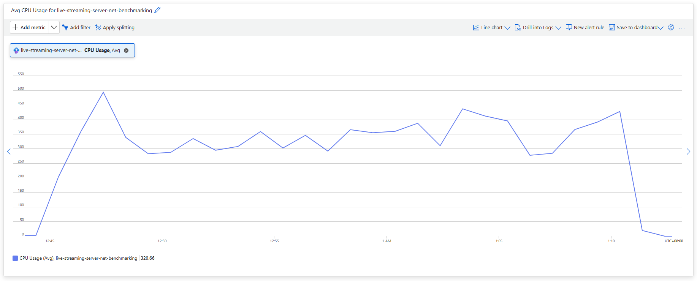

=== "Memory Usage"

    

=== "Network Bytes Received"

    

#### 150 Publishers Streaming RTMP Video at 480P and 500kbps

=== "CPU Usage"

    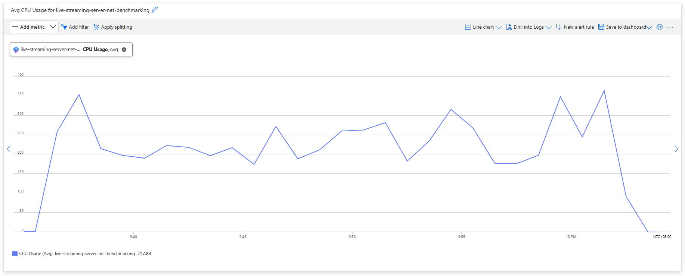

=== "Memory Usage"

    

=== "Network Bytes Received"

    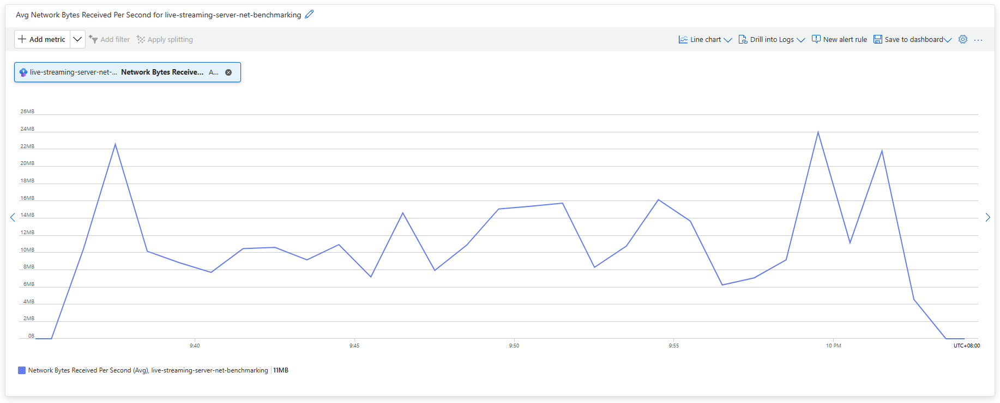

#### 100 Publishers Streaming RTMP Video at 720P and 1500kbps

=== "CPU Usage"

    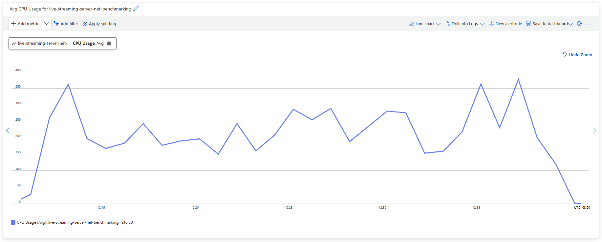

=== "Memory Usage"

    

=== "Network Bytes Received"

    

#### 1000 Subscribers Receiving RTMP Video at 720P and 1500kbps

=== "CPU Usage"

    

=== "Memory Usage"

    

=== "Network Bytes Received"

    

=== "Network Bytes Transmitted"

    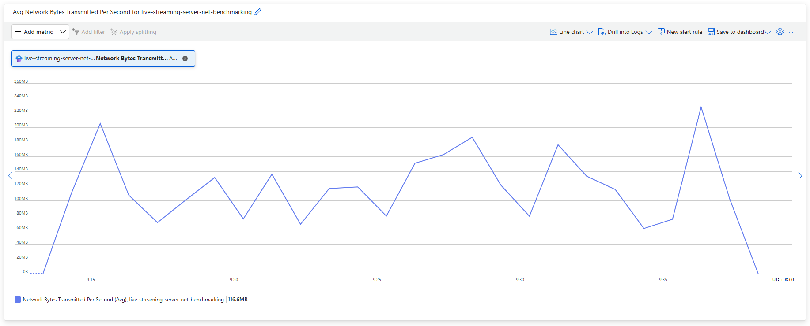

### Live-Streaming-Server-Net with GOP caching disabled

Generally, if the stream is to be served as HLS, GOP caching, which consumes additional memory, is not necessary. Therefore, the benchmark tests are also conducted with GOP caching disabled.

#### 150 Publishers Streaming RTMP Video at 240P and 200kbps

=== "CPU Usage"

    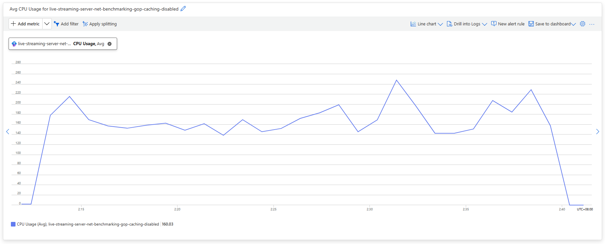

=== "Memory Usage"

    

=== "Network Bytes Received"

    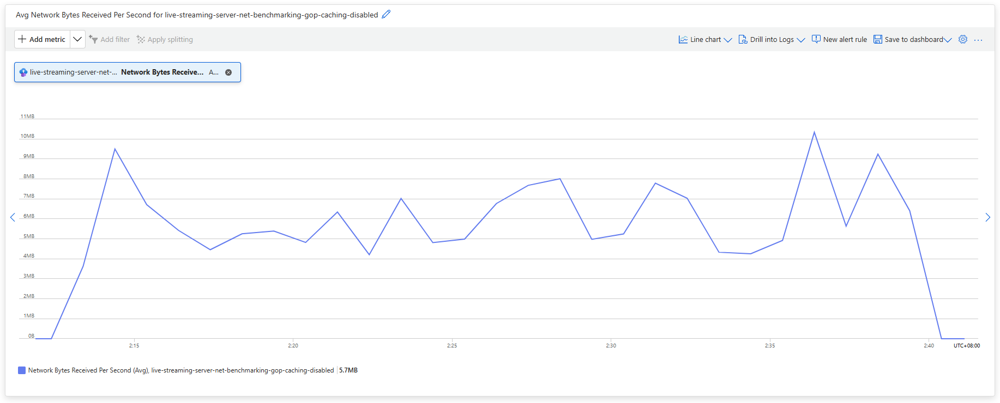

#### 300 Publishers Streaming RTMP Video at 240P and 200kbps

=== "CPU Usage"

    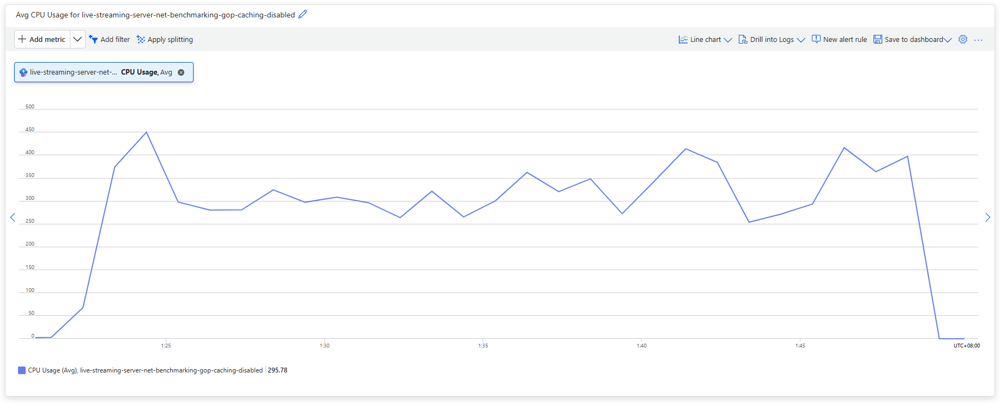

=== "Memory Usage"

    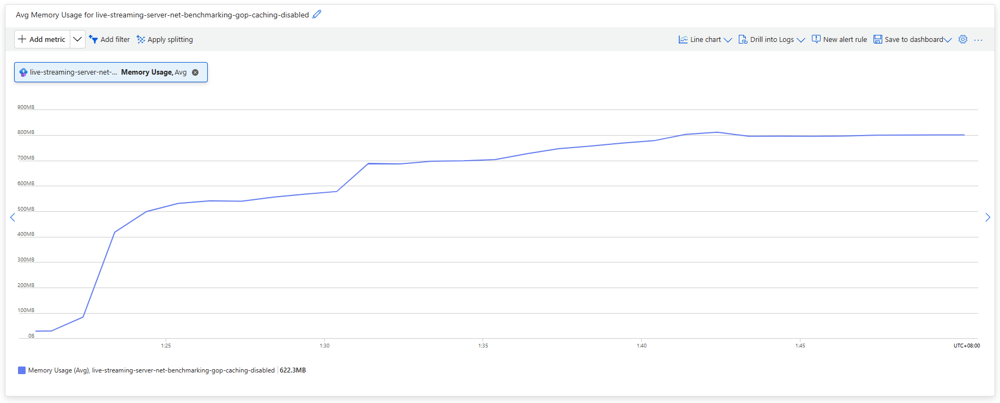

=== "Network Bytes Received"

    

#### 150 Publishers Streaming RTMP Video at 480P and 500kbps

=== "CPU Usage"

    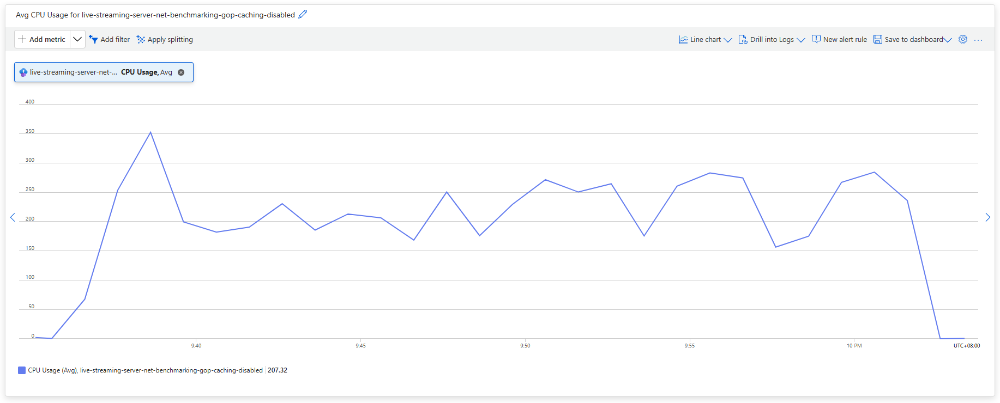

=== "Memory Usage"

    

=== "Network Bytes Received"

    

#### 100 Publishers Streaming RTMP Video at 720P and 1500kbps

=== "CPU Usage"

    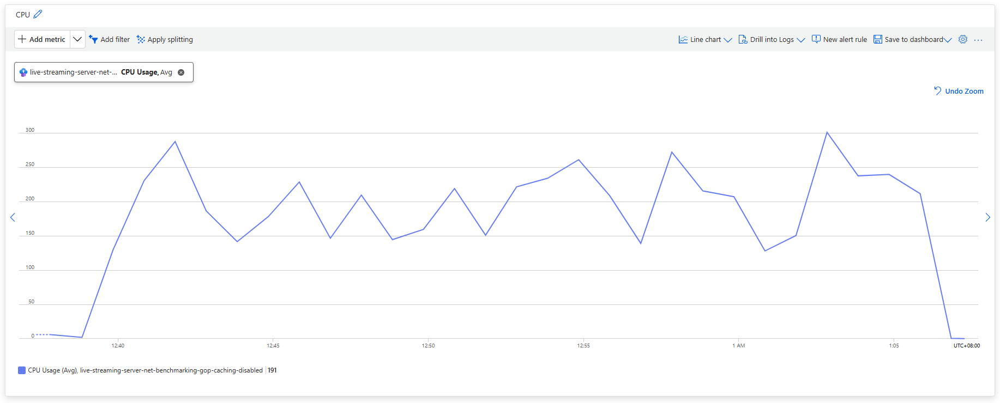

=== "Memory Usage"

    

=== "Network Bytes Received"

    

#### 200 Publishers Streaming RTMP Video at 720P and 1500kbps

=== "CPU Usage"

    

=== "Memory Usage"

    

=== "Network Bytes Received"

    

#### 300 Publishers Streaming RTMP Video at 720P and 1500kbps

=== "CPU Usage"

    

=== "Memory Usage"

    

=== "Network Bytes Received"

    

#### 400 Publishers Streaming RTMP Video at 720P and 1500kbps

=== "CPU Usage"

    

=== "Memory Usage"

    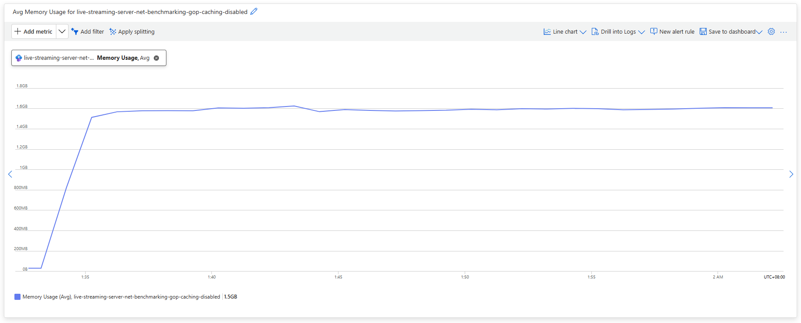

=== "Network Bytes Received"

    

### SRS (Simple Realtime Server) 5

As a reference, similar benchmark tests are performed on [SRS 5](https://github.com/ossrs/srs).

#### 150 Publishers Streaming RTMP Video at 240P and 200kbps

=== "CPU Usage"

    

=== "Memory Usage"

    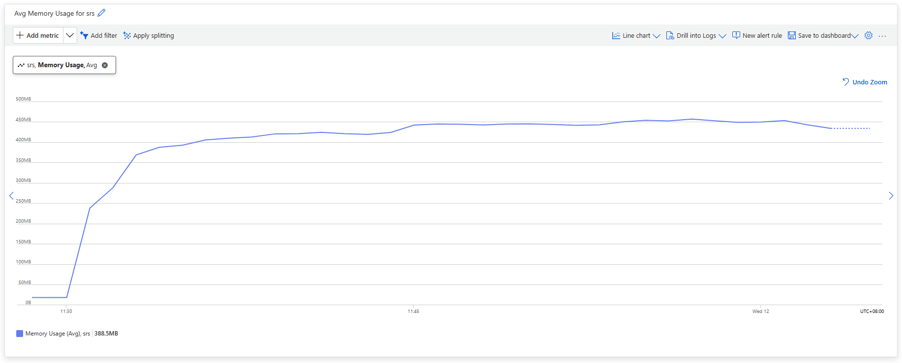

=== "Network Bytes Received"

    

#### 150 Publishers Streaming RTMP Video at 480P and 500kbps

=== "CPU Usage"

    

=== "Memory Usage"

    

=== "Network Bytes Received"

    

#### 100 Publishers Streaming RTMP Video at 720P and 1500kbps

=== "CPU Usage"

    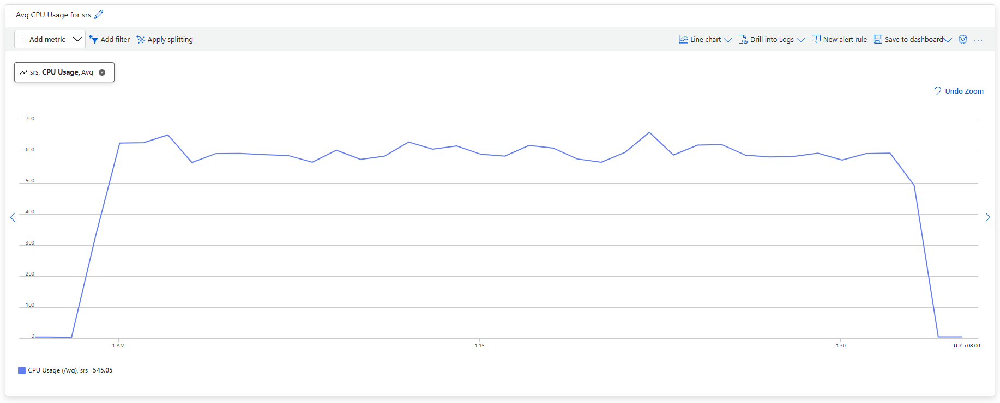

=== "Memory Usage"

    

=== "Network Bytes Received"

    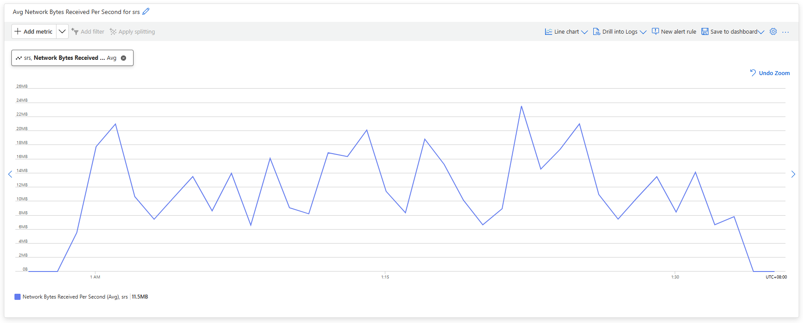

#### 1000 Subscribers Receiving RTMP Video at 720P and 1500kbps

=== "CPU Usage"

    

=== "Memory Usage"

    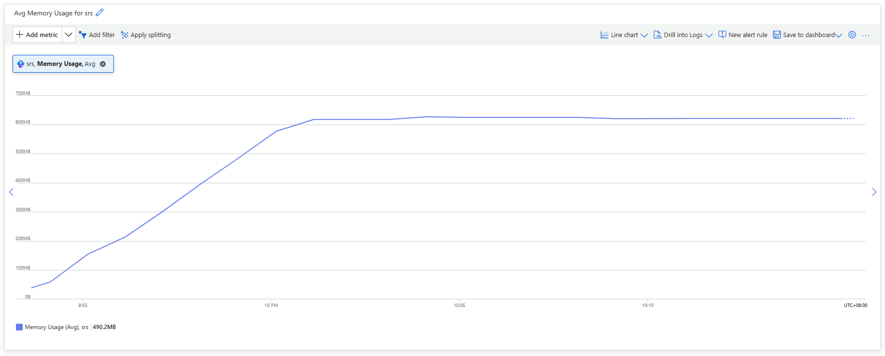

=== "Network Bytes Received"

    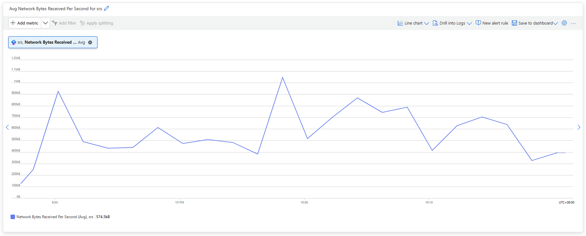

=== "Network Bytes Transmitted"

    
